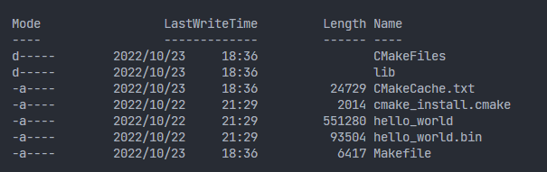
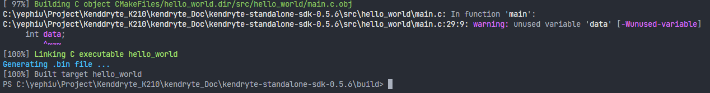
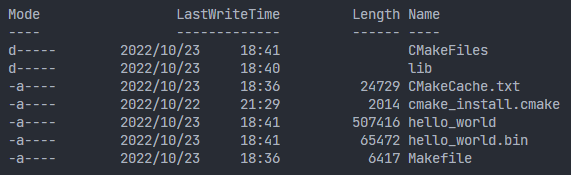
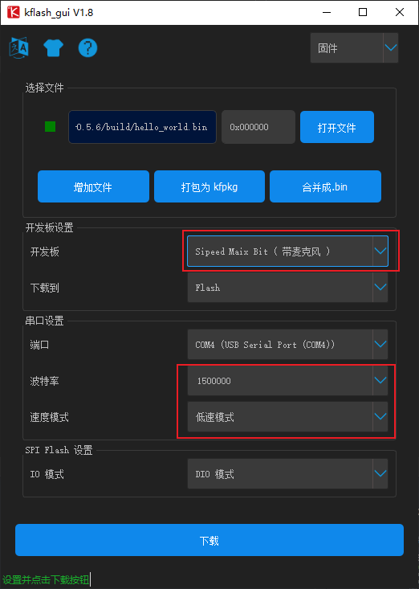

# K210编译

## 简介
- 环境：win10
- 软件：vscode
记录k210在C语言环境下编译程序的操作

## 教程
官方SDK编译
- 在vscode中打开官方SDK的文件夹，并进入src的目录可以看到hello_world的例程
    
- 打开终端，若没用终端可以在下图位置打开   
  
### 创建`build`文件夹并进入  
创建build文件夹用来保存Cmake编译产生的文件,包含编译中间文件以及最终烧录的固件
- 在终端中输入下面的代码  
    ``mkdir build``用来创建build文件夹  
    ``cd build``进入build文件夹的位置
### 使用Cmake生成Makefile文件
- 在终端中输入  
  `cmake ../ -DPROJ=hello_world -G “MinGW Makefiles”`
  
- 编译完成之后会在本目录下生成Makefiles相关文件  
  

### 使用Makefiles文件编译程序
- 在终端中输入  
  `make`
  
- 可以输入`ls`查看生成的文件
- 

### 后续的编译
在工程初期生成过一次Makefiles文件之后不需要再重新生成多一次Makefiles文件,可以直接使用`Make`再次进行固件编译

### 烧录固件
k210上烧录固件我们使用的kflash软件进行烧录
- 打开kflash软件,使用usb线材将K210开发板和电脑连接起来
- 选择好设备,波特率,烧录位置,已经准备要烧录的固件,点击烧录
  
- 注意事项:
  - 选择自己对应型号的板子,图例是矽速的Maix Bit K210开发板
  - 串口通信选择低速模式,不推荐使用过高的波特率