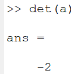
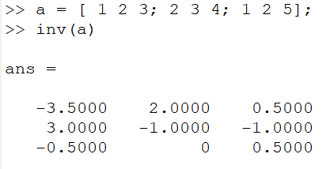
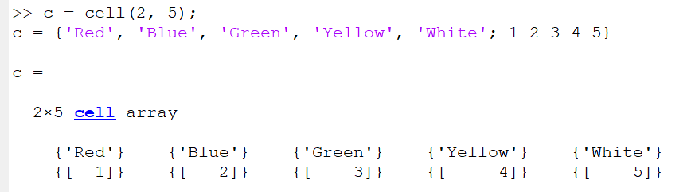
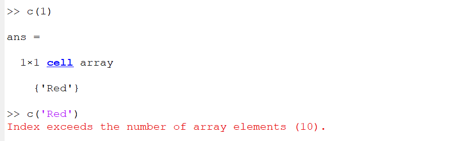
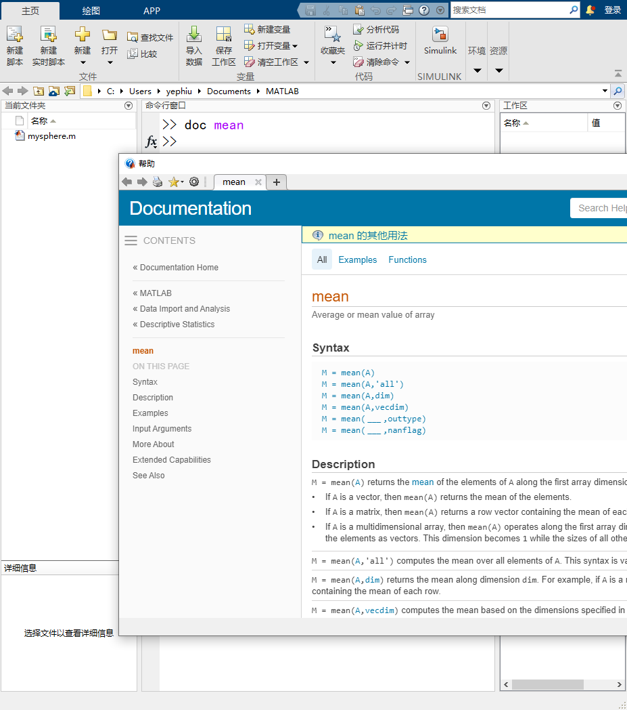
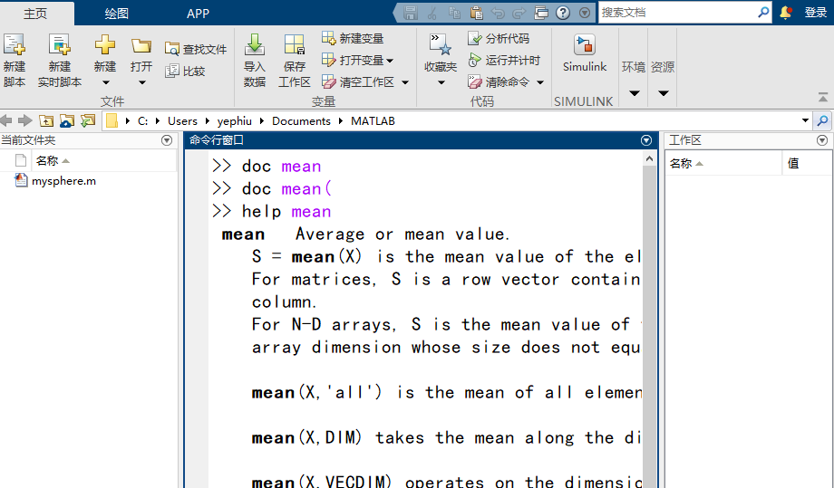

# Matlab学习笔记

## 目录

## 矩阵和数组
### 数组创建
- 创建行矩阵
  ```
  a=[1 2 3 4]
  ```
- 创建列矩阵
  ```
  a=[1;2;3;4]
  ```
- 创建普通矩阵
  ```
  a=[1 2 3;4 5 6]
  ```

### 矩阵生成
MATLAB为我们提供了四个用于生成基本矩阵的函数
|函数|作用|
|---|---|
| `zeros()`   | 生成零矩阵  |
|  `ones` |  生成全部为1的矩阵 |
| `rand ` | 均匀分布的随机数 |
| `randn`  | 正态分布的随机数 |


### 矩阵的运算
- 转置矩阵使用`'`;例如已知`a'`
- 矩阵标准乘法`*`;
- 矩阵的除法
  - 左除`/`
  - 右除`\`

### 数组的乘法
- 对于矩阵,数组内部元素的计算
  - `.*`元素机别乘法
  - `.^`元素级次方
  - `.'`非共轭数组转置
  - 同理可得`.+运算符`元素级别运算

### 矩阵的行列式
MATLAB中提供给`det`函数用于进行行列式运算

  
### 矩阵的逆矩阵
MATLAB中提供`inv()`用于计算逆矩阵

### 矩阵的串联
- `[a,a]`:行级串联
- `[a;a]`:列级串联
- 拓展:在matlab中`,`一般是行级别的操作,`;`一般是列级别操作符号

### 复数问题
在matlab中复数的表示一般是用`i`和`j`


### 数组的索引问题
像想要访问数组或者矩阵中的特定元素需要使用特定的方法
#### 访问单个元素
- 直接访问法: `A(8)`直接按照列的顺序进行访问
- 行列标访问法: `A(4,2)`按照(行,列)的顺序进行运输的访问
#### 访问多个元素
在matlab中我们想要引用多个元素有特定发的方法
- `start:end`:指定一个起始和结束的位置,例如列出前三行第二列的元素`A(1:3,2)`
- `A(3,:)`:对于某维度的全部元素进行选择我们使用`:`的形式,如前面就是选择第三行的全部元素
- `start:step:end` 等间距获取

---

## 工作区变量
在matlab中workspace保存各类变量的数据
- `who`:查看工作区内的内容
### 工作区的保存
退出matlab的时候我们可以使用`save`保存数据
```save myfile.mat```
### 工作区还原
使用`load`命令还原工作区数据
```load myfile.mat```
### 工作区清楚
对于工作区全部变量的清楚我们使用`clear`命令进行清除

---

## 文本和字符
### 变量是数据类型访问
可以使用`whos`对数据类型进行查询
```c++
>> a="hello world"
a = 
    "hello world"
>> whos a
  Name      Size            Bytes  Class     Attributes
  a         1x1               166  string    
```
### 字符串数据
在matlab中字符串的存储方式和在C语言中都是以**数组**的形式进行存储
### 声明字符串
在matlab中使用`"xxxx"`的形式对字符串进行声明
```t="hello world"```
### 字符串运算
`+`:将文本添加到字符串末尾
### 对于特定字符访问
`a(4)`直接访问特定元素

---

## 调用函数
在matlab中存在这大量的函数提供给我们进行调用
### 常用的函数
- `max()`:返回参数中的最大数字
- `min()`:返回参数中的最小数字
- `disp`:相当于printf,显示参数
### 返回数字的使用
对于matlab中存在返回多个数值的函数我们使用`[]`对多个函数进行接收
```[minA,maxA]=bound(A)```

---

## 二维图和三维图
### 二维图的绘制
要创建二维线图我们使用`plot()`函数
```C++
x = linspace(0,2*pi);
y = sin(x);
plot(x,y)
```
- `plot`的使用:
  - 前两个参数分别是`x`和`y`
  - 第三个参数用于设置线条设定,如线条颜色,样式,标记的字符,例如`plot(x,y,"r--")`
  - 其余设定样式如`+`,`o`,

### 相关函数
- `linspace()`:对定义域进行限制
- `xlabel()`和`ylabel()`:添加轴标题
- `title()`:添加图片标题
- `hold on()`:将绘图添加到现有的图窗中
- `hold off()`:在使用`hold off`或关闭窗口之前，当前图窗窗口中会显示所有绘图


### 三维图的绘制
创建三维图我们是用`surf(x,y,z)`

### 多图绘制
*对于2019之前的用用户参考subplot()*
- `tiledlayout(x,x)`:同一视窗内的图片绘制布局,x行x列
- `nexttile`:针对下一区域绘图

---
## 非线性函数计算

### 函数句柄
使用`@`在函数前面构造函数句柄

### 复合函数


---
## 脚本
### 各类语句
- if语句
  ```c++
  if num < 34
    sz = 'low'
  elseif num < 67
    sz = 'medium'
  else
    sz = 'high'
  end
  ```
- switch语句
  - `case`:可以是标量和字符串
  ```c++
  n = input('Enter a number: ');

  switch n  
      case -1
          disp('negative one')
      case 0
          disp('zero')
      case 1
          disp('positive one')
      otherwise
          disp('other value')
    end
  ```
---
## 索引
### 下标
- 单一下标`A(x)`
- 多下标`A(x,y)`

### 冒号运算符
- `start:end`:范围选择
- `start:step:end`:范围内等间距选择
- `:`:该维度数据全选
- `end`:在索引中表示最后一行或者最后一列

### 串联
- `[x,y]`:举例
  `B = [A  A+32; A+48  A+16]`

### find函数
- `find()`直接返回最简单的索引形式

---
## 向量

### 向量的模
MATLAB中没有直接提供计算向量模的方法
步骤如下:
- `.*`:使用数组元素相乘产生一个新的数组.该数组的元素是原数组元素的平方
- `sum()`:使用求和函数对新的数组每一项进行求和
- `sqrt()`:随后进行开方可以得到**模长**
### 向量的点积
MATLAB提供了`dot`现成的函数

---
## 单元矩阵
一种我看来类似于python中dict的语法
但是只能数字索引到obj



---
## 删除
- `[]`:举例
  `X(:,2) = []`删除第二列
---
## 实用的帮助和文档
- `doc`:在当初的窗口打开函数文档
  
- 在输入`(`后暂停可以获得相关函数的提示
- `help`:可以在命令行直接查看相关函数的简明文档
  
- `...`:相当于换行
- `↑`:输入上面的语句

---
## 注释
matlab中使用`%`作为注释
！[](matlab_pic/注释-1.png)

---
## Function
- `format`格式化显示
  ```
  >> format long
  >> pi
        ans =
            3.141592653589793
  ```
- `clc`清空命令行
- `exp()`自然对数
- `pi`:圆周率
- `realmin`:最小浮点数
- `realmax`:最大浮点数
- `inf`:无穷
- `NaN`:非数字

---
## 附录常用的函数和常数
